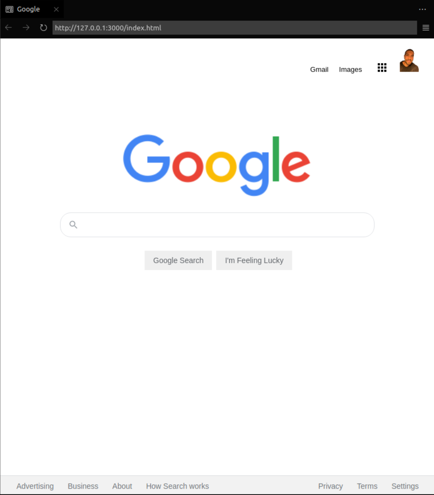

# Ödev 8 - Google Ana Sayfasını Tasarlamak

Bu projede ise [halihazırda yarım bırkalımış bir projeyi](https://drive.google.com/drive/folders/1Judez8Dqey-BHDjxZ1PnUwGhIMERNkbV) revize etmek suretiyle final görüntümüze kavuşturuyoruz. Tabi bolca güncel [google](www.google.com)'ı bolca 'Inspect' ederek...

## Projenin İlk Hali:

## Dokunuşlarım Sonrası Proje:

### License: [MIT](https://choosealicense.com/licenses/mit/)
---
[www.patika.dev](www.patika.dev)
